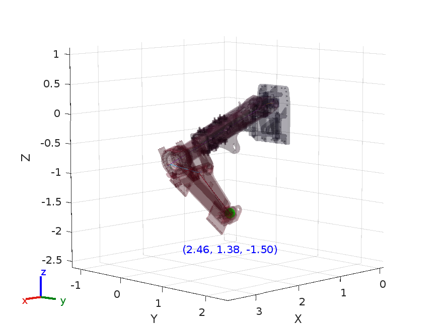

# KinIn: Inverse Kinematics Framework

## **1. Project Description**  
KinIn is a framework for iterative kinematic analysis of mechanical systems. It evaluates the feasibility of robotic calculations for complex mechanisms, particularly those with more than five degrees of freedom in heavy machinery. The framework uses iterative computation methods rather than traditional analytical techniques to achieve results.

This repository contains the framework files in Structured Text. The MATLAB directory includes a complementary example for better visualization and exploration of the mechanism.

## **2. Features**  
The functions are categorized as follows:

- **Inverse Functions**: Inv, LuDecomposition, LuInverse, pInv
- **Linear Algebra**: Eye, isValueNegligible, MatMul, Mat_byScalar, norm, Trace
- **Jacobian functions**: AdjointTransform, angVelToSkewSymMatrix, BodyJacobian, expToRotAxisAndAngle, Exp_se3_fromTrans, Exp_so3_fromRot, fastInverseTransform, getFwdKinematics_Body, getInvKinematics_Body, RotSO3_fromExpso3, se3ToSpatialVel, so3ToAngularVelocity, spatialVelToSE3Matrix, TransSE3_fromExp_se3, TransSE3_ToRotAndPos

For complete documentation and usage examples, please visit the [KinIn_documentation](https://yoyiberto.github.io/KinIn_documentation/).

## **3. Prerequisites & Recommended Environment**  
The recommended environment is CODESYS V3.5 SP20 with the library OSCAT BASIC installed.
For MATLAB, the code requires the Robotics System Toolbox. 
## **4. Installation & Setup**  
### CODESYS:
- Install CODESYS V3.5 from the official website if not already installed
- Install OSCAT BASIC 3.3.4.0 library (included as 'BASIC.library' in this repository or available on the CODESYS official website)
- Open the 'KinIn.project' in CODESYS

To install the library, click on the Tools tab in CODESYS IDE, then select Library Repository and Install. Alternatively, use CODESYS Installer.

### MATLAB:
- Install MATLAB or use MATLAB Online
- Install the Robotics System Toolbox via the addons tab
- The MATLAB folder contains all necessary files for running the demonstration

## **5. Usage Guide**  
### CODESYS: 
The framework is designed to integrate complex workflows. All files and functions are explicitly provided in this repository. The example in the CODESYS project works as follows:

PLC_PRG uses the 'INV KIN' function to calculate the angles needed to reach an arbitrary position (defined by a 4x4 matrix T). The function returns the solution in 'thetalist'.

### MATLAB: 
Run 'code.m' to visualize the results and verify that they match the CODESYS output, providing insight into how the mechanism will behave in real-world applications.

### **6. Demonstration & Examples**  
### CODESYS:
The framework includes examples for all functions and a real-world mechanism test case.
### MATLAB:
The MATLAB folder contains:

- STL meshes in the 'meshes' folder
- URDF file for robot description
- 'import_robot.m' file (the positions can be easily modified by changing the angles)
- Screenshots of example positions