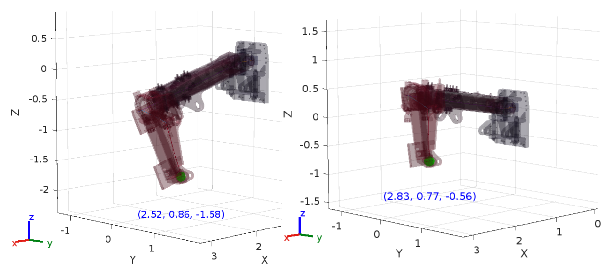

# KinIn framework 

KinIn is a framework designed for the iterative kinematic analysis of mechanical systems. The primary objective of the software is to assess the feasibility of performing robotic calculations for complex mechanisms, particularly those with more than five degrees of freedom in heavy machinery. The approach employed relies on iterative computation methods rather than traditional analytical techniques to achieve the desired results.

For installation instructions, see the [Getting Started](getting-started/installation.md) section.

## Functions structure

1. [Linear algebra](Modules/linAlg.md)
2. [Inverse functions](Modules/InverseFunctions.md)
3. [Jacobian functions](Modules/JacobianFunctions.md)

